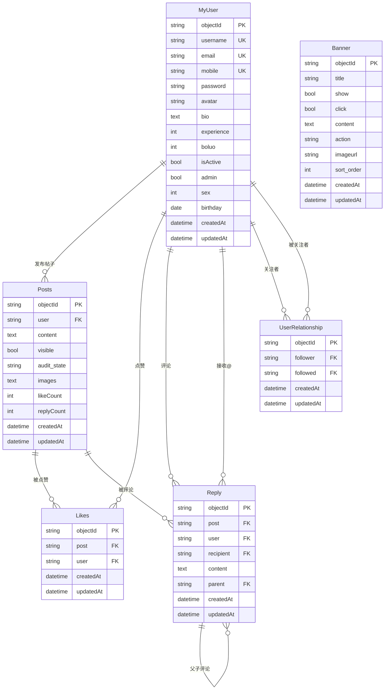

# SuperSpeedCalc Server

基于 Flask 框架的全功能后端服务，提供完整的社交化应用功能。包含用户管理、帖子系统、评论互动、点赞功能、用户关注、排行榜、论坛社区、图片管理、横幅广告、历史记录统计、应用版本发布等核心功能。支持多维度排行榜查询（日榜、月榜、年榜、总榜）和完善的用户统计分析。

## 🌟 核心特性

- 🔐 **完整用户系统**：注册登录、密码更新、手机号密码重置、用户信息管理
- 📝 **帖子系统**：发布帖子、图片上传、内容管理、审核机制
- 💬 **评论系统**：两级评论（评论+回复）、@用户功能
- 👍 **点赞系统**：帖子点赞、防重复点赞、点赞统计
- 👥 **用户关注**：关注/取消关注、粉丝列表、互关列表
- 🏆 **排行榜系统**：多维度排名、实时统计、历史记录
- 🖼️ **图片管理**：图片上传、批量处理、静态文件服务  
- 📱 **横幅广告**：轮播图管理、广告投放、排序控制
- 📊 **数据统计**：用户行为分析、内容统计、排名算法
- 🚀 **版本发布**：APK管理、更新控制、发布管理
- 📱 **短信服务**：Bmob短信验证码发送和验证功能，支持手机号密码重置

## 📁 项目结构

```
SuperSpeedCalc-Server/
├── app.py                 # Flask 应用主文件
├── config.py             # 配置文件
├── start.py              # 启动脚本
├── manage_db.py          # 数据库管理工具
├── requirements.txt      # 项目依赖
├── README.md                        # 项目说明文档
├── MOBILE_PASSWORD_RESET_SUMMARY.md # 手机号密码重置功能总结 ✨新增
├── models/              # 数据库模型目录 
│   ├── __init__.py      # 模型包初始化
│   ├── base.py          # 基础模型和数据库实例
│   ├── user.py          # 用户模型
│   ├── posts.py         # 帖子模型 ✨新增
│   ├── likes.py         # 点赞模型 ✨新增
│   ├── reply.py         # 评论模型 ✨新增
│   ├── relationship.py  # 用户关系模型 ✨新增
│   ├── banner.py        # 横幅模型 ✨新增
│   ├── chart.py         # 图表模型
│   ├── forum.py         # 论坛模型
│   ├── image.py         # 图片模型
│   ├── history.py       # 历史记录模型
│   └── releases.py      # 发布版本模型
├── routes/              # API 路由蓝图
│   ├── __init__.py      # 路由包初始化
│   ├── user/            # 用户相关 API
│   │   ├── create.py    # 用户创建、注册、登录
│   │   ├── read.py      # 用户查询
│   │   ├── update.py    # 用户更新、密码更新、手机号密码重置 ✨优化
│   │   └── delete.py    # 用户删除
│   ├── posts/           # 帖子相关 API ✨新增
│   │   ├── create.py    # 帖子创建
│   │   ├── read.py      # 帖子查询、筛选
│   │   ├── update.py    # 帖子更新、点赞功能
│   │   ├── likes.py     # 点赞查询功能
│   │   └── delete.py    # 帖子删除
│   ├── replies/         # 评论相关 API ✨新增
│   │   ├── create.py    # 评论创建
│   │   ├── read.py      # 评论查询（两级评论）
│   │   ├── update.py    # 评论更新
│   │   └── delete.py    # 评论删除
│   ├── relationship/    # 用户关注 API ✨新增
│   │   ├── create.py    # 关注用户
│   │   ├── read.py      # 粉丝/关注/互关列表
│   │   └── delete.py    # 取消关注
│   ├── banners/         # 横幅广告 API ✨新增
│   │   ├── create.py    # 横幅创建
│   │   ├── read.py      # 横幅查询、活跃横幅
│   │   ├── update.py    # 横幅更新、统计
│   │   └── delete.py    # 横幅删除
│   ├── charts/          # 图表相关 API
│   ├── forum/           # 论坛相关 API
│   ├── image/           # 图片相关 API
│   ├── history/         # 历史记录相关 API
│   ├── releases/        # 发布版本相关 API
│   └── sms/             # 短信服务 API ✨新增
│       ├── sendsms.py   # 发送短信验证码
│       └── verifysms.py # 验证短信验证码
├── scripts/             # 数据库迁移脚本
├── examples/            # 使用示例和文档
│   ├── sms_usage_example.py              # 短信服务使用示例
│   └── mobile_password_reset_example.py  # 手机号密码重置示例 ✨新增
├── uploads/             # 文件上传目录
│   ├── images/          # 图片文件存储
│   └── apk/             # APK文件存储
└── instance/            # 实例配置和数据库
    └── app.db           # SQLite数据库文件
```

## 🗄️ 数据库表结构

### 核心数据表

#### MyUser 表（用户表）
- `objectId` (String, Primary Key): 用户唯一标识 
- `username` (String, Unique): 用户名
- `email` (String, Unique, Nullable): 邮箱（可为空）
- `mobile` (String, Unique, Nullable): 手机号（可为空）
- `password` (String): 密码（加密存储）
- `avatar` (String): 头像地址
- `bio` (Text): 个人简介
- `experience` (Integer): 用户经验值，默认0
- `boluo` (Integer): 菠萝币数量，默认0
- `isActive` (Boolean): 是否激活
- `admin` (Boolean): 是否管理员，默认False
- `sex` (Integer): 性别（1=男，0=女），默认1
- `birthday` (Date): 生日（YYYY-MM-DD）
- `createdAt` (DateTime): 创建时间
- `updatedAt` (DateTime): 更新时间

#### Posts 表（帖子表）✨ 新增
- `objectId` (String, Primary Key): 帖子唯一标识
- `user` (String, Foreign Key): 发帖用户ID
- `content` (Text): 帖子内容
- `visible` (Boolean): 是否公开可见，默认True
- `audit_state` (String): 审核状态（pending/approved/rejected），默认pending
- `images` (Text): 图片列表（JSON格式）
- `likeCount` (Integer): 点赞数量，默认0
- `replyCount` (Integer): 评论数量，默认0
- `createdAt` (DateTime): 创建时间
- `updatedAt` (DateTime): 更新时间

#### Likes 表（点赞表）✨ 新增
- `objectId` (String, Primary Key): 点赞记录唯一标识
- `post` (String, Foreign Key): 帖子ID
- `user` (String, Foreign Key): 点赞用户ID
- `createdAt` (DateTime): 点赞时间
- `updatedAt` (DateTime): 更新时间
- **唯一约束**: (`post`, `user`) - 防止重复点赞

#### Reply 表（评论表）✨ 新增
- `objectId` (String, Primary Key): 评论唯一标识
- `post` (String, Foreign Key): 帖子ID
- `user` (String, Foreign Key): 评论用户ID
- `recipient` (String, Foreign Key, Nullable): 接收者用户ID（@用户功能）
- `content` (Text): 评论内容
- `parent` (String, Foreign Key, Nullable): 父评论ID（空=一级评论，非空=二级回复）
- `createdAt` (DateTime): 创建时间
- `updatedAt` (DateTime): 更新时间

#### UserRelationship 表（用户关系表）✨ 新增
- `objectId` (String, Primary Key): 关系记录唯一标识
- `follower` (String, Foreign Key): 关注者用户ID
- `followed` (String, Foreign Key): 被关注者用户ID
- `createdAt` (DateTime): 关注时间
- `updatedAt` (DateTime): 更新时间
- **唯一约束**: (`follower`, `followed`) - 防止重复关注

#### Banner 表（横幅表）✨ 新增
- `objectId` (String, Primary Key): 横幅唯一标识
- `title` (String): 横幅标题
- `show` (Boolean): 是否展示，默认True
- `click` (Boolean): 是否可点击，默认True
- `content` (Text): 横幅内容/描述
- `action` (String): 点击动作（url/page/modal等）
- `imageurl` (String): 图片链接
- `sort_order` (Integer): 排序权重，默认0
- `createdAt` (DateTime): 创建时间
- `updatedAt` (DateTime): 更新时间

### 数据库关系图



### 原有数据表

#### Charts 表（排行榜表）
- `objectId` (String, Primary Key): 记录唯一标识
- `title` (String): 标题
- `achievement` (Float): 成绩值，默认0.0
- `user` (String, Foreign Key): 所属用户ID
- `createdAt` (DateTime): 创建时间
- `updatedAt` (DateTime): 更新时间

### Forum 表（社区表）
- `objectId` (String, Primary Key): 帖子唯一标识
- `content` (Text): 帖子内容
- `category` (String): 帖子分类
- `tags` (JSON): 标签列表
- `public` (Boolean): 是否公开，默认True
- `images` (JSON): 图片列表，存储图片URL数组
- `viewCount` (Integer): 浏览次数
- `likeCount` (Integer): 点赞数
- `replyCount` (Integer): 回复数
- `isPinned` (Boolean): 是否置顶
- `isClosed` (Boolean): 是否关闭
- `user` (String, Foreign Key): 作者ID
- `createdAt` (DateTime): 创建时间
- `updatedAt` (DateTime): 更新时间

### Image 表（图片表）
- `objectId` (String, Primary Key): 图片唯一标识
- `fileName` (String): 图片文件名
- `path` (String): 图片本地路径
- `url` (String): 图片访问URL（如：`/uploads/images/<filename>`）
- `fileSize` (Integer): 文件大小（字节）
- `createdAt` (DateTime): 创建时间
- `updatedAt` (DateTime): 更新时间

### History 表（历史记录表）
- `objectId` (String, Primary Key): 历史记录唯一标识
- `title` (String): 标题，最大200字符
- `score` (Integer): 分数，可以为正数或负数
- `user` (String, Foreign Key): 用户ID，关联到my_user表
- `createdAt` (DateTime): 创建时间
- `updatedAt` (DateTime): 更新时间

### AppRelease 表（发布版本表）
- `objectId` (String, Primary Key): 发布记录唯一标识
- `app_name` (String): 应用名称
- `version_name` (String): 版本号（如 1.2.3）
- `version_code` (Integer): 版本代码（整数）
- `changelog` (Text): 更新内容
- `download_url` (String): 下载链接（如：`/uploads/apk/<filename>`）
- `environment` (String): 发布环境（development/production/staging...），默认 `production`
- `status` (String): 发布状态（如 `draft`/`published`/`deprecated`），默认 `published`
- `is_update` (Boolean): 是否更新（用于客户端提示更新），默认 False
- `force_update` (Boolean): 是否强制更新，默认 False
- `createdAt` (DateTime): 创建时间
- `updatedAt` (DateTime): 更新时间

## ⭐ 功能特性

### 🎯 核心社交功能 ✨
- **帖子系统**: 内容发布、图片上传、审核机制、可见性控制
- **评论互动**: 两级评论系统（评论+回复）、@用户功能、层级管理
- **点赞系统**: 帖子点赞、防重复点赞、点赞统计、用户点赞历史
- **用户关注**: 关注/粉丝管理、互关查询、社交网络构建
- **横幅管理**: 广告轮播、排序控制、活跃状态管理

### 🔐 用户管理系统
- **用户管理**: 支持邮箱/手机号注册登录、用户信息管理、经验值和菠萝币系统
- **密码安全**: 密码加密存储、旧密码验证更新、手机号密码重置、安全策略
- **权限控制**: 管理员权限、内容审核、操作授权

### 🏆 数据统计系统
- **图表系统**: 成绩记录、排行榜查询、用户排名统计
- **历史记录**: 用户游戏历史记录、多维度排行榜（日/月/年/总榜）、统计分析
- **数据统计**: 用户得分统计、排名查询、时间段过滤、分页查询

### 📱 内容管理系统
- **论坛社区**: 帖子发布、分类管理、点赞互动、置顶/关闭控制
- **图片管理**: 单个/批量图片上传、文件存储、静态资源访问
- **发布管理**: APK版本发布管理、文件上传、版本控制、更新提示
- **短信服务**: Bmob短信验证码发送和验证，支持手机号注册验证和密码重置

### 🏆 History功能亮点
- **智能排行榜**: 支持日榜、月榜、年榜、总榜
- **完整用户信息**: 所有查询都返回用户的完整信息（头像、经验等）
- **灵活分数系统**: 支持正负数计算，适应各种游戏场景
- **时间精确统计**: 基于UTC时间的精确时间段统计
- **高性能查询**: 使用SQL聚合函数，支持分页和排序

## 🚀 快速开始

### 新功能快速上手 ✨

#### 1️⃣ 社交功能体验
```bash
# 启动服务
python start.py

# 创建用户
curl -X POST "http://localhost:5000/users/register" \
  -H "Content-Type: application/json" \
  -d '{"email": "test@example.com", "password": "123456"}'

# 发布帖子
curl -X POST "http://localhost:5000/posts/" \
  -H "Content-Type: application/json" \
  -d '{
    "user": "返回的用户ID",
    "content": "Hello World! 我的第一篇帖子 🎉",
    "images": []
  }'

# 评论帖子
curl -X POST "http://localhost:5000/replies/" \
  -H "Content-Type: application/json" \
  -d '{
    "post": "帖子ID",
    "user": "用户ID", 
    "content": "很棒的分享！"
  }'

# 点赞帖子
curl -X POST "http://localhost:5000/posts/帖子ID/like" \
  -H "Content-Type: application/json" \
  -d '{"user_id": "用户ID"}'
```

#### 2️⃣ 用户关注体验
```bash
# 用户A关注用户B
curl -X POST "http://localhost:5000/users/userA/follow/userB"

# 查看用户A的关注列表
curl "http://localhost:5000/users/userA/following"

# 查看互关好友
curl "http://localhost:5000/users/userA/mutual"
```

#### 3️⃣ 横幅管理体验
```bash
# 创建横幅（需要管理员权限）
curl -X POST "http://localhost:5000/banners/" \
  -H "Content-Type: application/json" \
  -d '{
    "title": "欢迎使用SuperSpeedCalc",
    "content": "体验最好的速算应用",
    "imageurl": "banner.jpg",
    "action": "page",
    "admin_user_id": "admin用户ID"
  }'

# 获取活跃横幅
curl "http://localhost:5000/banners/active"
```

#### 4️⃣ 短信验证码体验
```bash
# 发送短信验证码
curl -X POST "http://localhost:8000/sms/send" \
  -H "Content-Type: application/json" \
  -d '{"phone": "13800138000"}'

# 验证短信验证码
curl -X POST "http://localhost:8000/sms/verify" \
  -H "Content-Type: application/json" \
  -d '{"phone": "13800138000", "code": "123456"}'

# 根据手机号重置密码
curl -X POST "http://localhost:8000/users/reset-password" \
  -H "Content-Type: application/json" \
  -d '{
    "mobile": "13800138000",
    "new_password": "newpass123"
  }'
```

## 🔧 环境要求

- **Python**: 3.7+ (推荐使用 Python 3.8+)
- **操作系统**: Windows、macOS、Linux
- **内存**: 最低 512MB（生产环境推荐 1GB+）
- **磁盘**: 100MB+（用于数据库和上传文件存储）

## 安装和运行

### 1. 安装依赖

```bash
# 推荐使用国内镜像源加速安装
pip install -r requirements.txt -i https://mirrors.aliyun.com/pypi/simple/

# 或者使用默认源
pip install -r requirements.txt

# 如果使用虚拟环境（推荐）
python -m venv venv
source venv/bin/activate  # Linux/macOS
# 或者 venv\Scripts\activate  # Windows
pip install -r requirements.txt -i https://mirrors.aliyun.com/pypi/simple/
```

### 2. 配置Bmob短信服务（可选）

如果需要使用短信验证码功能，需要配置Bmob服务：

```bash
# 创建.env文件（推荐）
echo "BMOB_APPLICATION_ID=你的Application_ID" >> .env
echo "BMOB_REST_API_KEY=你的REST_API_Key" >> .env
echo "BMOB_MASTER_KEY=你的Master_Key" >> .env
```

或者在 `config.py` 中直接修改配置值。

### 3. 数据库管理

#### 首次使用 - 初始化数据库
```bash
# 方式1: 使用数据库管理脚本（推荐）
python manage_db.py init

# 方式2: 使用应用启动参数
python app.py --init-db
```

#### 日常使用 - 启动应用
```bash
# 推荐：使用启动脚本（自动检查依赖和初始化数据库）
python start.py

# 或者直接启动应用（需要手动初始化数据库）
python app.py
```

#### 数据库管理命令
```bash
# 检查数据库状态
python manage_db.py check

# 备份数据库
python manage_db.py backup

# 重置数据库（删除所有数据）
python manage_db.py reset

# 查看帮助
python manage_db.py help
```

### 变更迁移
- 新增了 `mobile` 字段，并将 `email` 改为可空；已有数据库请执行：
```bash
python scripts/migrate_add_user_fields.py
```
该脚本会：
- 自动添加 `mobile` 列并创建唯一索引
- 将 `email` 改为可空（SQLite 采用表重建方式）

- 新增了 `history` 表，已有数据库请执行：
```bash
python scripts/migrate_add_history_table.py
```

- 新增了 `app_releases` 表，已有数据库请执行：
```bash
python scripts/migrate_add_releases_table.py
```

- 将 `history` 表中的 `user_id` 字段重命名为 `user`（参考charts表设计），已有数据库请执行：
```bash
python scripts/migrate_rename_user_id_to_user.py
```

- 将 `history` 表中的 `scope` 字段重命名为 `score`，已有数据库请执行：
```bash
python scripts/migrate_rename_scope_to_score.py
```

- 从 `my_user` 表中移除了 `score` 字段，已有数据库请执行：
```bash
python scripts/migrate_drop_user_score.py
```

- 将 `my_user` 表中的 `experence` 字段重命名为 `experience`，已有数据库请执行：
```bash
python scripts/migrate_rename_experence_to_experience.py
```

### 最新更新（2024年版本）
- **排行榜优化**: Charts API 排行榜现在按成绩升序排列（分数越低排名越高）
- **过滤增强**: 排行榜支持按 `title` 参数过滤特定标题的成绩记录
- **排名算法**: 更新排名计算逻辑，适配升序排序规则

### 静态文件/上传
- 图片：
  - 目录：`uploads/images/`
  - 访问：
    - 新路径：`/uploads/images/<filename>`
    - 兼容旧路径：`/static/images/<filename>`（映射到同一目录）
- APK：
  - 目录：`uploads/apk/`
  - 访问：`/uploads/apk/<filename>`

### 4. 应用地址

根据不同的启动方式：
- **推荐方式**：使用 `python start.py` 启动，应用将在 `http://localhost:5000` 运行
- **开发方式**：使用 `python app.py` 启动，应用将在 `http://localhost:8000` 运行
- **健康检查端点**：`http://localhost:5000/health` 或 `http://localhost:8000/health`

### 5. 短信服务测试

```bash
# 测试短信API功能
python test_sms_api.py

# 运行短信服务使用示例
python examples/sms_usage_example.py

# 运行手机号密码重置示例
python examples/mobile_password_reset_example.py
```

> 注意：如果5000端口被占用（如被AirPlay Receiver占用），建议使用8000端口或者在系统偏好设置->共享中关闭AirPlay接收器服务。

### 6. 测试脚本

项目提供了完整的测试脚本来验证功能：

```bash
# 测试基础History API功能
python test_history_api.py

# 测试排行榜和统计功能
python test_leaderboard_api.py

# 测试用户信息返回完整性
python test_user_info.py

# 添加测试数据
python add_history_data.py

# 查看数据统计
python check_history_data.py
```

#### 测试数据说明
- `add_history_data.py`: 为4个用户添加28条测试记录，包含不同分数段
- `check_history_data.py`: 查看当前数据库中的历史记录和排行榜
- 所有测试脚本都会自动清理测试数据，不影响生产环境

## 🚀 API 接口

### 新增功能 API ✨

#### 短信服务 API (`/sms`) 📱

**基础操作**
- `POST /sms/send` - 发送短信验证码
  - 必填：`phone`（手机号，11位数字）
  - 返回：发送结果和手机号
- `POST /sms/verify` - 验证短信验证码
  - 必填：`phone`（手机号）、`code`（6位验证码）
  - 返回：验证结果和用户信息

#### 用户密码重置 API (`/users`) 🔐

**密码重置**
- `POST /users/reset-password` - 根据手机号重置密码
  - 必填：`mobile`（手机号，11位数字）、`new_password`（新密码，至少6个字符）
  - 验证：短信验证码验证由客户端处理
  - 返回：重置结果和用户信息

**使用示例**
```bash
# 发送短信验证码
curl -X POST "http://localhost:8000/sms/send" \
  -H "Content-Type: application/json" \
  -d '{"phone": "13800138000"}'

# 验证短信验证码
curl -X POST "http://localhost:8000/sms/verify" \
  -H "Content-Type: application/json" \
  -d '{"phone": "13800138000", "code": "123456"}'

# 根据手机号重置密码（客户端已验证短信验证码）
curl -X POST "http://localhost:8000/users/reset-password" \
  -H "Content-Type: application/json" \
  -d '{
    "mobile": "13800138000",
    "new_password": "newpass123"
  }'
```

**响应格式**
```json
// 发送成功
{
  "success": true,
  "message": "短信验证码发送成功",
  "phone": "13800138000"
}

// 验证成功
{
  "success": true,
  "message": "短信验证码验证成功",
  "phone": "13800138000",
  "verified": true
}

// 密码重置成功
{
  "success": true,
  "message": "密码更新成功",
  "data": {
    "id": "user123",
    "username": "用户名",
    "mobile": "13800138000",
    "updatedAt": "2024-01-15T12:30:00"
  }
}
```

#### 帖子系统 API (`/posts`)

**基础操作**
- `POST /posts/` - 创建帖子
  - 必填：`user`（用户ID）、`content`（内容）
  - 可选：`visible`（是否公开，默认true）、`audit_state`（审核状态，默认pending）、`images`（图片数组）
- `GET /posts/` - 获取帖子列表（支持排序、分页、筛选）
  - 分页：`page`、`per_page`
  - 排序：`sort_by`（createdAt/likeCount/replyCount）、`order`（asc/desc）
  - 筛选：`visible_only`、`approved_only`、`user_id`（当前用户ID，用于权限控制）
  - 搜索：`keyword`（内容搜索）
- `GET /posts/{post_id}` - 获取单个帖子详情
- `PUT /posts/{post_id}` - 更新帖子（作者权限）
- `DELETE /posts/{post_id}` - 删除帖子（作者或管理员权限）

**点赞功能**
- `POST /posts/{post_id}/like` - 点赞帖子
- `DELETE /posts/{post_id}/like` - 取消点赞
- `GET /posts/{post_id}/likers` - 获取点赞用户列表
- `GET /posts/user/{user_id}/liked` - 获取用户点赞的帖子

**管理功能**
- `GET /posts/user/{user_id}` - 获取用户的帖子列表
- `GET /posts/audit/{audit_state}` - 按审核状态获取帖子（管理员）
- `POST /posts/{post_id}/audit` - 更新审核状态（管理员）

#### 评论系统 API (`/replies`)

**基础操作**
- `POST /replies/` - 创建评论/回复
  - 必填：`post`（帖子ID）、`user`（用户ID）、`content`（内容）
  - 一级评论：不传`parent`
  - 二级回复：传`parent`（父评论ID）、可选`recipient`（@用户ID）
- `GET /replies/post/{post_id}` - 获取帖子的评论列表
  - 分页：`page`、`per_page`
  - 筛选：`level`（1=一级评论，2=二级回复）、`include_children`（是否包含子回复）
- `GET /replies/{reply_id}` - 获取单个评论详情
- `PUT /replies/{reply_id}` - 更新评论（作者权限）
- `DELETE /replies/{reply_id}` - 删除评论（作者或管理员权限）

**专项查询**
- `GET /replies/post/{post_id}/first-level` - 获取一级评论（带子回复）
- `GET /replies/user/{user_id}` - 获取用户评论列表

#### 用户关注 API (`/users`)

**关注操作**
- `POST /users/{user_id}/follow/{target_user_id}` - 关注用户
- `DELETE /users/{user_id}/follow/{target_user_id}` - 取消关注
- `GET /users/{user_id}/follow/{target_user_id}` - 检查关注关系

**关注查询**
- `GET /users/{user_id}/followers` - 获取粉丝列表（分页）
- `GET /users/{user_id}/following` - 获取关注列表（分页）
- `GET /users/{user_id}/mutual` - 获取互关列表（分页）

#### 横幅广告 API (`/banners`)

**基础操作**
- `POST /banners/` - 创建横幅（管理员权限）
- `GET /banners/` - 获取横幅列表（支持排序、分页、筛选）
  - 排序：`sort_by`（title/sort_order/createdAt）、`order`（asc/desc）
  - 筛选：`show_only`、`active_only`
  - 搜索：`keyword`（标题和内容搜索）
- `GET /banners/{banner_id}` - 获取单个横幅详情
- `PUT /banners/{banner_id}` - 更新横幅（管理员权限）
- `DELETE /banners/{banner_id}` - 删除横幅（管理员权限）

**客户端使用**
- `GET /banners/active` - 获取活跃横幅列表
  - 参数：`limit`（限制数量）
- `POST /banners/{banner_id}/view` - 记录横幅展示
- `POST /banners/{banner_id}/click` - 记录横幅点击

**管理功能**
- `GET /banners/stats` - 横幅统计信息（管理员）
- `POST /banners/{banner_id}/sort-order` - 更新排序权重

### 原有功能 API

#### 用户系统增强 API (`/users`) ✨

**密码管理**
- `POST /users/{user_id}/password` - 更新密码
  - 必填：`old_password`（旧密码）、`new_password`（新密码，至少6个字符）
  - 安全验证：必须提供正确的旧密码才能更新
- `POST /users/reset-password` - 根据手机号重置密码
  - 必填：`mobile`（手机号）、`new_password`（新密码）
  - 安全验证：短信验证码验证由客户端处理

### 分页约定
- **查询参数**：`page`（默认 1），`per_page`（默认 10 或 20，视接口而定，最大 100 或 200）。
- **返回结构**：列表接口返回如下结构（不同接口会携带额外字段，如 `message`、`period` 等）：
```json
{
  "message": "获取列表成功",
  "data": [/* 列表数据 */],
  "pagination": { "page": 1, "per_page": 20, "total": 123, "pages": 7 }
}
```

### 用户基础 API (`/users`)

**基础操作**
- `GET /users` - 获取所有用户
  - 分页：`page`、`per_page`
  - 排序：`sort_by`（支持 `username`、`email`、`mobile`、`experience`、`boluo`、`isActive`、`admin`、`sex`、`birthday`、`createdAt`、`updatedAt`）、`order`（`asc`/`desc`）
  - 模糊搜索：`keyword` 或 `q`（对 `username`、`email`、`mobile` 进行不区分大小写匹配）
- `GET /users/count` - 获取用户总数
- `GET /users/<object_id>` - 获取单个用户
- `POST /users` - 创建用户（后台管理）
  - 必填：`username`、`password`
  - 二选一：`email` 或 `mobile`
  - 可选：`avatar`、`bio`、`experience`、`boluo`、`isActive`、`admin`、`sex`、`birthday`
- `POST /users/register` - 注册用户（安卓/客户端）
  - 必填：`password`
  - 二选一：`email` 或 `mobile`
  - 自动：`username`（服务端按“形容词+名词+时间戳后6位”生成，并保证唯一）
- `POST /users/login` - 用户登录
  - 方式一：`email` + `password`
  - 方式二：`mobile` + `password`
- `PUT /users/<object_id>` - 更新用户信息
- `POST /users/<object_id>/password` - 更新密码（需验证旧密码）✨
- `DELETE /users/<object_id>` - 删除用户
- `POST /users/<object_id>/experience` - 更新用户经验值
- `POST /users/<object_id>/boluo` - 更新用户菠萝币

#### 示例
- 列表模糊搜索
```
GET /users?keyword=cat
GET /users?q=138
```

### 图表 API (`/charts`)

- `GET /charts` - 获取图表列表
  - 分页：`page`、`per_page`
  - 过滤：`user`
  - 排序：`sort_by`（`objectId`、`title`、`achievement`、`user`、`createdAt`、`updatedAt`），`order`（`asc`/`desc`）
- `GET /charts/<object_id>` - 获取单个图表
- `POST /charts` - 创建图表
- `PUT /charts/<object_id>` - 更新图表
- `DELETE /charts/<object_id>` - 删除图表
- `GET /charts/leaderboard` - 获取排行榜（按成绩值升序排序，支持分页）
  - 分页：`page`、`per_page`
  - 过滤：`title`（可选）：筛选特定标题的排行榜
- `GET /charts/rank` - 根据 `title` 与 `achievement` 查询排名
  - 必填：`title`、`achievement`
  - 可选：`scope=global|title`（默认 `global`）
  - 说明：按 `achievement` 升序，排名 = 比该分数更低的数量 + 1（同分并列）
  - 示例：`/charts/rank?title=Speed%20Run&achievement=123.45&scope=title`
- `GET /charts/user-rank` - 根据用户ID和标题查询用户成绩和排名
  - 必填：`user`（用户ID）、`title`（标题）
  - 返回：用户完整信息、成绩、排名、同分数量、总记录数
  - 说明：按 `achievement` 升序排序，分数越低排名越高
- `POST /charts/<object_id>/achievement` - 更新图表成绩值

#### Charts API 使用示例
```bash
# 获取全局排行榜（所有标题，按成绩升序）
curl "http://localhost:5000/charts/leaderboard?page=1&per_page=10"

# 获取特定标题的排行榜
curl "http://localhost:5000/charts/leaderboard?title=数学计算&page=1&per_page=5"

# 查询用户在特定标题中的排名
curl "http://localhost:5000/charts/rank?title=数学计算&achievement=85.5&scope=title"

# 查询用户在全局排行榜中的排名
curl "http://localhost:5000/charts/rank?title=数学计算&achievement=85.5&scope=global"

# 查询特定用户在指定标题下的成绩和排名
curl "http://localhost:5000/charts/user-rank?user=user123&title=数学计算"
```

### 📱 新功能使用示例 ✨

#### 帖子系统使用
```bash
# 创建帖子
curl -X POST "http://localhost:5000/posts/" \
  -H "Content-Type: application/json" \
  -d '{
    "user": "user123",
    "content": "这是我的第一篇帖子！今天天气真好 😊",
    "images": ["image1.jpg", "image2.jpg"],
    "visible": true
  }'

# 获取帖子列表（已审核的公开帖子）
curl "http://localhost:5000/posts/?page=1&per_page=20&visible_only=true&approved_only=true&user_id=current_user"

# 点赞帖子
curl -X POST "http://localhost:5000/posts/post123/like" \
  -H "Content-Type: application/json" \
  -d '{"user_id": "user456"}'

# 获取帖子的点赞用户列表
curl "http://localhost:5000/posts/post123/likers?page=1&per_page=20"
```

#### 评论系统使用
```bash
# 创建一级评论
curl -X POST "http://localhost:5000/replies/" \
  -H "Content-Type: application/json" \
  -d '{
    "post": "post123",
    "user": "user456",
    "content": "很棒的帖子！"
  }'

# 创建二级回复（@用户）
curl -X POST "http://localhost:5000/replies/" \
  -H "Content-Type: application/json" \
  -d '{
    "post": "post123",
    "user": "user789",
    "content": "@张三 我也觉得很不错",
    "parent": "reply123",
    "recipient": "user456"
  }'

# 获取帖子的一级评论（带子回复）
curl "http://localhost:5000/replies/post/post123/first-level?page=1&per_page=10"
```

#### 用户关注系统使用
```bash
# 关注用户
curl -X POST "http://localhost:5000/users/user123/follow/user456"

# 获取粉丝列表
curl "http://localhost:5000/users/user123/followers?page=1&per_page=20"

# 获取互关列表
curl "http://localhost:5000/users/user123/mutual?page=1&per_page=20"

# 检查关注关系
curl "http://localhost:5000/users/user123/follow/user456"
```

#### 横幅管理使用
```bash
# 创建横幅（管理员）
curl -X POST "http://localhost:5000/banners/" \
  -H "Content-Type: application/json" \
  -d '{
    "title": "新年促销活动",
    "content": "全场商品5折起，快来抢购！", 
    "imageurl": "https://example.com/banner.jpg",
    "action": "url",
    "show": true,
    "click": true,
    "sort_order": 1,
    "admin_user_id": "admin123"
  }'

# 获取活跃横幅（客户端使用）
curl "http://localhost:5000/banners/active?limit=5"

# 记录横幅点击
curl -X POST "http://localhost:5000/banners/banner123/click"
```

#### 密码更新使用
```bash
# 安全更新密码（需要旧密码验证）
curl -X POST "http://localhost:5000/users/user123/password" \
  -H "Content-Type: application/json" \
  -d '{
    "old_password": "old_password_123",
    "new_password": "new_secure_password_456"
  }'

# 根据手机号重置密码（忘记密码时使用）
curl -X POST "http://localhost:8000/users/reset-password" \
  -H "Content-Type: application/json" \
  -d '{
    "mobile": "13800138000",
    "new_password": "new_secure_password_456"
  }'
```

### 📋 新功能响应格式示例

#### 帖子详情响应
```json
{
  "success": true,
  "data": {
    "objectId": "post123",
    "content": "这是一篇很棒的帖子",
    "visible": true,
    "audit_state": "approved",
    "images": ["image1.jpg", "image2.jpg"],
    "likeCount": 15,
    "replyCount": 8,
    "author_data": {
      "objectId": "user123",
      "username": "张三",
      "avatar": "avatar.jpg",
      "bio": "热爱分享的用户",
      "experience": 2000,
      "followers_count": 100,
      "following_count": 50
    },
    "is_liked_by_user": true,
    "is_visible": true,
    "is_approved": true,
    "stats": {
      "actual_like_count": 15,
      "actual_reply_count": 8,
      "first_level_reply_count": 5,
      "second_level_reply_count": 3
    }
  }
}
```

#### 评论详情响应（二级回复）
```json
{
  "success": true,
  "data": {
    "objectId": "reply456",
    "content": "@张三 我完全同意你的观点",
    "level": 2,
    "is_second_level": true,
    "user_data": {
      "objectId": "user456",
      "username": "李四",
      "avatar": "avatar2.jpg"
    },
    "recipient_data": {
      "objectId": "user123",
      "username": "张三",
      "avatar": "avatar.jpg"
    },
    "parent_reply_data": {
      "objectId": "reply123",
      "content": "这是父评论内容",
      "user_info": {
        "username": "王五"
      }
    },
    "post_data": {
      "objectId": "post123",
      "content": "原帖内容"
    }
  }
}
```

#### 用户关注响应
```json
{
  "success": true,
  "data": {
    "user": {
      "objectId": "user123",
      "username": "张三",
      "avatar": "avatar.jpg"
    },
    "followers": [
      {
        "objectId": "user456",
        "username": "粉丝1",
        "avatar": "avatar2.jpg",
        "bio": "用户简介"
      }
    ],
    "pagination": {
      "page": 1,
      "per_page": 20,
      "total": 150,
      "pages": 8
    }
  }
}
```

#### 用户排名查询响应格式
```json
{
  "success": true,
  "data": {
    "user_info": {
      "objectId": "user123",
      "username": "玩家张三",
      "avatar": "avatar.jpg",
      "bio": "我是游戏爱好者",
      "experience": 1500,
      "boluo": 200,
      "isActive": true,
      "admin": false,
      "sex": 1,
      "birthday": "1995-06-15",
      "createdAt": "2024-01-01T00:00:00",
      "updatedAt": "2024-01-15T12:30:00"
    },
    "achievement": 85.5,
    "rank": 3,
    "title": "数学计算",
    "total_records": 50,
    "ties_count": 2,
    "record": {
      "objectId": "chart456",
      "title": "数学计算",
      "achievement": 85.5,
      "user": { /* 同上user_info */ },
      "createdAt": "2024-01-10T14:20:00",
      "updatedAt": "2024-01-10T14:20:00"
    }
  }
}
```

### 论坛 API (`/forum`)

- `GET /forum` - 获取帖子列表
  - 分页：`page`、`per_page`
  - 过滤：`category`、`user`、`isPinned`（`true|false`）、`public`（`true|false`）
  - 排序：置顶优先（`isPinned` 降序），其后按 `createdAt` 降序
- `GET /forum/<object_id>` - 获取单个帖子
- `GET /forum/categories` - 获取所有帖子分类（支持分页）
  - 分页：`page`、`per_page`
- `GET /forum/popular` - 获取热门帖子（支持分页）
  - 分页：`page`、`per_page`
  - 排序：`sort_by=viewCount|likeCount`
- `GET /forum/public` - 获取公开帖子（支持分页）
  - 分页：`page`、`per_page`
- `POST /forum` - 创建帖子
- `PUT /forum/<object_id>` - 更新帖子
- `POST /forum/<object_id>/like` - 点赞
- `DELETE /forum/<object_id>` - 删除帖子

### 图片 API (`/images`)

- `GET /images` - 获取图片列表
  - 分页：`page`、`per_page`
  - 排序：`sort_by`（支持 `fileName`、`fileSize`、`createdAt`、`updatedAt`）、`order`（`asc`/`desc`）
- `GET /images/<object_id>` - 获取单个图片
- `GET /images/stats` - 获取图片统计信息（总数量、总大小）
- `GET /images/search` - 按文件名搜索
  - 参数：`q`
  - 分页：`page`、`per_page`
- `POST /images` - 创建图片记录（JSON方式）
- `PUT /images/<object_id>` - 更新图片信息
- `DELETE /images/<object_id>` - 删除图片
- `POST /images/upload` - 上传单个图片文件（multipart/form-data，字段名：`file`）
- `POST /images/upload/multiple` - 批量上传图片文件（multipart/form档），字段名：`files`

### 发布版本 API (`/releases`)

- `GET /releases` - 获取发布记录列表
  - 分页：`page`、`per_page`
  - 过滤：`app_name`、`environment`、`status`
  - 排序：按创建时间倒序
- `GET /releases/count` - 获取发布记录数量（支持同样的过滤）
- `GET /releases/<object_id>` - 获取单个发布记录
- `POST /releases` - 创建发布记录
  - 必填：`app_name`、`version_name`、`version_code`
  - 可选：`changelog`、`download_url`、`environment`（默认 `production`）、`status`（默认 `published`）、`is_update`、`force_update`
- `PUT /releases/<object_id>` - 更新发布记录
- `DELETE /releases/<object_id>` - 删除发布记录
- `POST /releases/upload-apk` - 上传 APK 文件（multipart/form-data）
  - 字段：`file`（必填，.apk）、`release_id`（可选；若提供，将自动回写该记录的 `download_url`）

#### 发布版本示例
```bash
# 创建发布记录
curl -X POST "http://localhost:5000/releases/" \
  -H "Content-Type: application/json" \
  -d '{
    "app_name": "SuperSpeedCalc",
    "version_name": "1.0.0",
    "version_code": 100,
    "changelog": "初始化发布",
    "is_update": true,
    "force_update": false
  }'

# 上传 APK 并绑定到发布记录（release_id 为创建返回的 objectId）
curl -X POST "http://localhost:5000/releases/upload-apk?release_id=<objectId>" \
  -F "file=@/path/to/app-release.apk"

# 仅上传 APK，不绑定记录（可得到文件 URL，之后手动写入）
curl -X POST "http://localhost:5000/releases/upload-apk" \
  -F "file=@/path/to/app-release.apk"
```

### 历史记录 API (`/history`)

#### 基础操作
- `GET /history` - 获取历史记录列表
  - 分页：`page`、`per_page`
  - 过滤：`user`（按用户ID过滤）
  - 排序：按创建时间倒序
  - 返回：包含完整的用户信息（用户名、头像、经验等）
- `GET /history/count` - 获取历史记录总数
  - 可选：`user`（按用户ID统计）
- `GET /history/<object_id>` - 获取单个历史记录
  - 返回：包含完整的用户信息
- `POST /history` - 创建历史记录
  - 必填：`title`、`score`、`user`
  - 说明：`score` 必须为整数，可以为正数或负数
- `PUT /history/<object_id>` - 更新历史记录
  - 可选：`title`、`score`、`user`
- `DELETE /history/<object_id>` - 删除历史记录

#### 排行榜功能
- `GET /history/leaderboard` - 获取用户得分排行榜（基于历史记录分数总和）
  - 分页：`page`、`per_page`
  - 时间段：`period`（`all`=总榜，`daily`=日榜，`monthly`=月榜，`yearly`=年榜）
  - 返回：用户排名、总分、历史记录数量，包含完整的用户信息
  - 算法：基于历史记录 `score` 字段的总和进行排序，支持正负数计算

#### 用户统计
- `GET /history/stats` - 获取用户历史分数统计信息
  - 必填：`user`
  - 返回：今日、本月、今年、总计的分数、记录数量与对应榜单排名（`rank`），包含完整的用户信息。
  - 说明：当某周期用户无任何记录时，该周期的 `rank` 返回 `null`。
  - 时间计算：基于UTC时间，日榜从当天00:00:00开始，月榜从当月1号开始，年榜从当年1月1日开始

#### 使用示例
```bash
# 创建历史记录
curl -X POST "http://localhost:5000/history/" \
  -H "Content-Type: application/json" \
  -d '{
    "title": "超级速度计算挑战",
    "score": 1500,
    "user": "user123"
  }'

# 获取总排行榜
curl "http://localhost:5000/history/leaderboard?period=all"

# 获取日榜
curl "http://localhost:5000/history/leaderboard?period=daily"

# 获取用户统计
curl "http://localhost:5000/history/stats?user=user123"

# 获取用户历史记录
curl "http://localhost:5000/history/?user=user123"
```

## History功能使用指南

### 🚀 快速开始

1. **创建历史记录**
   ```bash
   curl -X POST "http://localhost:5000/history/" \
     -H "Content-Type: application/json" \
     -d '{
       "title": "游戏挑战",
       "score": 1000,
       "user": "user123"
     }'
   ```

2. **查看排行榜**
   ```bash
   # 总排行榜
   curl "http://localhost:5000/history/leaderboard?period=all"
   
   # 日榜
   curl "http://localhost:5000/history/leaderboard?period=daily"
   
   # 月榜
   curl "http://localhost:5000/history/leaderboard?period=monthly"
   
   # 年榜
   curl "http://localhost:5000/history/leaderboard?period=yearly"
   ```

3. **获取用户统计**
   ```bash
   curl "http://localhost:5000/history/stats?user=user123"
   ```

### 📊 数据格式说明

#### 历史记录结构
```json
{
  "objectId": "abc123def",
  "title": "游戏挑战",
  "score": 1000,
  "user": {
    "objectId": "user123",
    "username": "玩家1",
    "avatar": "avatar.jpg",
    "experience": 100,
    "boluo": 50,
    "isActive": true,
    "admin": false,
    "sex": 1,
    "birthday": "1990-01-01",
    "createdAt": "2024-01-01T00:00:00",
    "updatedAt": "2024-01-01T00:00:00"
  },
  "createdAt": "2024-01-01T12:00:00",
  "updatedAt": "2024-01-01T12:00:00"
}
```

#### 排行榜结构
```json
{
  "message": "获取all排行榜成功",
  "data": [
    {
      "rank": 1,
      "total_score": 5000,
      "history_count": 5,
      "user": {
        "objectId": "user123",
        "username": "玩家1",
        "avatar": "avatar.jpg",
        "experience": 100,
        "boluo": 50
      }
    }
  ],
  "pagination": {
    "page": 1,
    "per_page": 20,
    "total": 10,
    "pages": 1,
    "has_next": false,
    "has_prev": false
  },
  "period": "all"
}
```

#### 用户统计结构
```json
{
  "message": "获取用户历史分数统计成功",
  "data": {
    "user": {
      "objectId": "user123",
      "username": "玩家1",
      "avatar": "avatar.jpg"
    },
    "stats": {
      "today": { "total_score": 1000, "count": 2, "rank": 3 },
      "month": { "total_score": 3000, "count": 8, "rank": 5 },
      "year": { "total_score": 5000, "count": 15, "rank": 7 },
      "total": { "total_score": 5000, "count": 15, "rank": 9 }
    }
  }
}
```

### 🔧 高级功能

#### 分页查询
```bash
# 获取第2页，每页10条记录
curl "http://localhost:5000/history/?page=2&per_page=10"

# 获取排行榜第1页，每页5条记录
curl "http://localhost:5000/history/leaderboard?period=all&page=1&per_page=5"
```

#### 用户过滤
```bash
# 获取特定用户的历史记录
curl "http://localhost:5000/history/?user=user123"

# 获取特定用户的历史记录数量
curl "http://localhost:5000/history/count?user=user123"
```

### 🎮 应用场景

- **游戏排行榜**: 实时显示玩家排名和分数
- **成就系统**: 记录玩家的游戏成就和进步
- **数据分析**: 分析玩家的游戏习惯和表现
- **社交功能**: 展示玩家的游戏历史和成就
- **竞赛系统**: 支持各种时间段的竞赛排名

### 📈 性能优化

- **SQL聚合查询**: 使用数据库层面的GROUP BY和SUM进行高效统计
- **分页机制**: 支持灵活的分页查询，避免大量数据传输
- **索引优化**: 为外键字段和查询频繁字段建立合理索引
- **缓存友好**: API设计考虑缓存策略，支持条件查询减少数据量
- **排序优化**: 排行榜查询使用数据库原生排序，性能优异
- **并发处理**: Flask多线程支持，适合中等并发场景

## 项目总结

### 🎯 项目特点
- **模块化设计**: 蓝图模块化架构，清晰的目录结构和代码组织
- **RESTful API**: 标准的REST API设计，完整的CRUD操作
- **完整社交功能**: 帖子发布、评论互动、点赞系统、用户关注等现代社交应用功能 ✨
- **智能用户系统**: 自动生成用户名、双重登录方式（邮箱/手机号）、安全密码管理、手机号密码重置
- **多级评论系统**: 支持两级评论（评论+回复）、@用户功能、层级管理 ✨
- **完整功能覆盖**: 用户管理、帖子系统、排行榜、社区、文件上传、版本发布、横幅管理一应俱全
- **灵活排行榜系统**: 支持升序排序、多标题过滤、精确排名计算
- **多维度统计**: 日/月/年/总榜多时间维度，实时统计分析
- **数据完整性**: 外键关联、级联删除、数据校验、防重复约束等数据库最佳实践 ✨
- **高性能查询**: SQL聚合查询、分页支持、索引优化、关联数据预加载
- **扩展性强**: 支持数据库迁移、环境配置、一键部署

### 🚀 技术栈
- **后端框架**: Flask 2.3.3 + Flask-SQLAlchemy 3.0.5
- **跨域支持**: Flask-CORS 4.0.0
- **数据库**: SQLite（默认），支持 MySQL（使用 PyMySQL）
- **密码加密**: Werkzeug 安全模块
- **短信服务**: Bmob短信服务（bmobpy 1.10.1）
- **API设计**: RESTful风格，蓝图模块化架构
- **数据格式**: JSON，完整的分页和错误处理
- **文件处理**: 支持图片（PNG/JPG）和APK文件上传存储
- **配置管理**: 支持环境变量配置和多环境部署

### 📊 数据模型
- **用户模型 (MyUser)**: 完整的用户信息管理，支持经验值、菠萝币、权限控制、关注关系
- **帖子模型 (Posts)**: 社交帖子系统，支持图片、审核、可见性控制 ✨
- **点赞模型 (Likes)**: 点赞关系管理，防重复点赞、完整统计 ✨
- **评论模型 (Reply)**: 两级评论系统，支持@用户、层级回复 ✨
- **关系模型 (UserRelationship)**: 用户关注系统，支持粉丝、关注、互关查询 ✨
- **横幅模型 (Banner)**: 广告轮播管理，支持排序、状态控制 ✨
- **图表模型 (Charts)**: 成绩记录和排行榜系统
- **论坛模型 (Forum)**: 社区帖子管理，支持分类、标签、互动统计
- **图片模型 (Image)**: 文件上传管理，自动生成访问URL
- **历史记录模型 (History)**: 用户游戏历史，支持多维度统计分析
- **发布模型 (AppRelease)**: 应用版本发布管理，支持更新控制

### 🔧 开发工具
- **测试脚本**: 完整的API测试覆盖（`test_*.py`）
- **数据迁移**: 多个迁移脚本支持数据库结构平滑升级（`scripts/migrate_*.py`）
- **数据库管理**: 专用的数据库管理工具（`manage_db.py`）
- **启动脚本**: 智能启动脚本，自动检查依赖和初始化（`start.py`）
- **数据填充**: 测试数据生成和统计工具（`add_history_data.py`、`check_history_data.py`）
- **短信测试**: SMS API测试脚本和使用示例（`test_sms_api.py`、`examples/sms_usage_example.py`）
- **密码重置**: 手机号密码重置使用示例（`examples/mobile_password_reset_example.py`）
- **配置指南**: 详细的SMS配置指南（`SMS_SETUP_GUIDE.md`）
- **功能总结**: 手机号密码重置功能实现总结（`MOBILE_PASSWORD_RESET_SUMMARY.md`）
- **文档完善**: 详细的API文档和使用指南，包含完整的curl示例

### 🎮 应用场景
- **社交平台**: 帖子发布、评论互动、点赞系统、用户关注网络 ✨
- **内容管理**: 帖子审核、横幅广告、图片管理、内容展示
- **游戏平台**: 用户管理、排行榜、成就系统、历史记录
- **社区应用**: 论坛、图片分享、用户互动、社交功能
- **数据分析**: 用户行为分析、统计报表、关注关系分析
- **竞赛系统**: 多维度排行榜、实时统计、用户排名
- **用户验证**: 手机号注册验证、短信验证码登录、手机号密码重置、安全验证 ✨

### 📈 项目优势
- **生产就绪**: 完整的错误处理、健康检查端点、配置管理
- **性能优化**: SQL聚合查询、分页机制、索引设计
- **安全特性**: 密码哈希存储、数据校验、SQL注入防护
- **易于部署**: 支持Docker部署、环境变量配置、一键启动
- **维护友好**: 详细的日志输出、清晰的代码结构、完善的文档
- **可扩展性**: 模块化设计支持轻松添加新功能和API端点

---

## 🎉 项目总结

SuperSpeedCalc Server 是一个功能完整、架构清晰的现代化后端服务项目。通过 Flask + SQLAlchemy 构建，提供了完整的社交化应用功能，包括用户管理、帖子系统、评论互动、点赞功能、用户关注、排行榜、社区论坛、图片管理、横幅广告、历史记录统计、版本发布等核心功能。项目采用蓝图模块化设计，支持多种数据库，具有良好的扩展性和维护性。

### 🌟 核心亮点
- **完整的社交体系**：帖子发布、两级评论、点赞系统、用户关注等现代社交功能 ✨
- **完整的用户体系**：支持邮箱/手机号注册登录，密码安全管理，经验值和积分系统
- **强大的统计功能**：多维度排行榜（日/月/年/总榜），实时用户统计分析
- **智能内容管理**：帖子审核、横幅管理、图片上传、版本发布一应俱全
- **短信验证服务**：集成Bmob短信服务，支持手机号验证码发送、验证和密码重置 ✨
- **数据关联完整**：所有API返回完整的关联对象信息，减少客户端请求次数 ✨
- **开发友好**：完整的测试脚本、数据迁移工具、详细的API文档

### 📞 技术支持
如果您在使用过程中遇到问题，请参考：
1. **API文档**：详细的接口说明和示例
2. **测试脚本**：`test_*.py` 文件提供完整的功能验证
3. **数据库管理**：`manage_db.py` 提供数据库操作工具
4. **启动脚本**：`start.py` 提供智能启动和依赖检查

### 🚀 生产环境部署建议

#### 基本部署配置
```bash
# 1. 安装依赖
pip install -r requirements.txt

# 2. 设置环境变量
export FLASK_ENV=production
export SECRET_KEY=your_secret_key_here

# 3. 初始化数据库
python manage_db.py init

# 4. 启动服务
python start.py
```

#### 性能优化建议
- **Web服务器**: 生产环境建议使用 Gunicorn + Nginx
- **数据库**: 大数据量场景建议使用 MySQL 替代 SQLite
- **静态文件**: 配置 Nginx 直接服务静态文件，减轻应用服务器负担
- **缓存策略**: 可集成 Redis 进行排行榜和热门内容缓存
- **监控日志**: 集成日志系统，监控API性能和错误

#### 安全配置
- 生产环境需注释掉 `app.py` 第18行的 `CORS(app)` 
- 配置合适的CORS策略和安全头
- 使用HTTPS协议保护数据传输
- 定期更新依赖包版本

项目持续更新维护中，欢迎使用！ 🚀