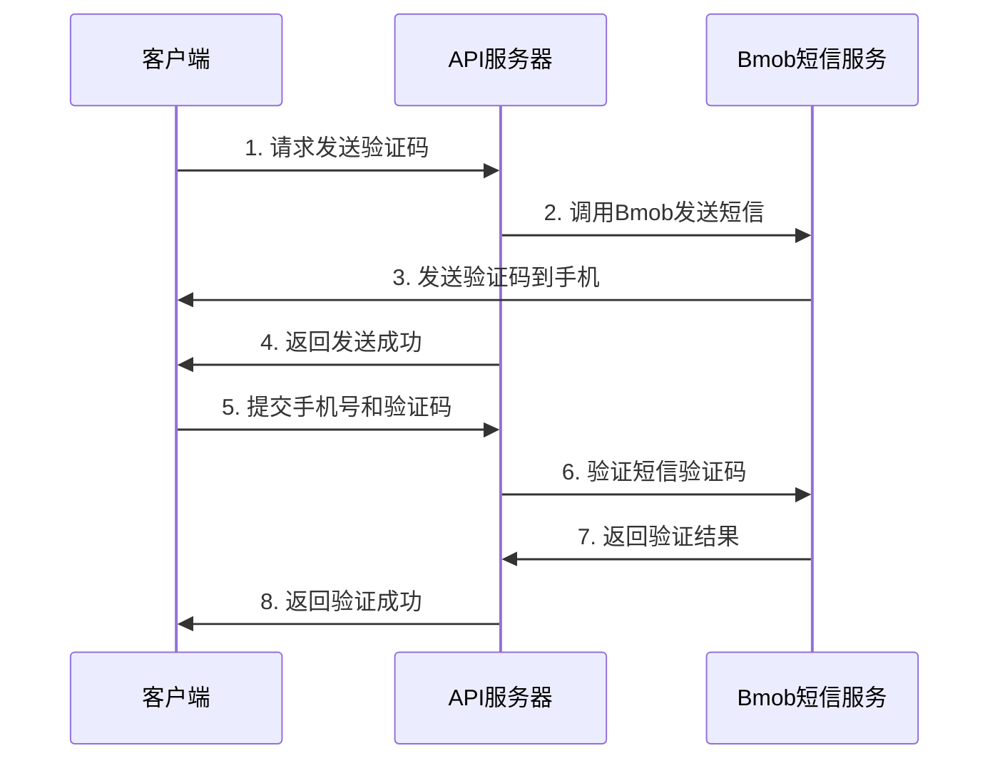

# 短信服务 API

## 基础信息
- **基础路径**: `/sms`
- **服务提供商**: Bmob
- **主要功能**: 短信验证码发送和验证，支持手机号密码重置

## 接口列表

### 1. 发送短信验证码
**POST** `/sms/send`

#### 请求体
```json
{
  "phone": "13800138000"
}
```

#### 请求参数说明
| 参数 | 类型 | 必填 | 说明 |
|------|------|------|------|
| phone | string | 是 | 手机号码（支持 phone 或 phone_number 字段） |

#### 请求示例
```bash
curl -X POST http://localhost:8000/sms/send \
  -H "Content-Type: application/json" \
  -d '{"phone": "13800138000"}'
```

#### 响应示例
```json
{
  "code": 200,
  "message": "短信验证码发送成功",
  "data": {
    "phone": "13800138000"
  }
}
```

### 2. 验证短信验证码
**POST** `/sms/verify`

#### 请求体
```json
{
  "phone": "13800138000",
  "code": "123456"
}
```

#### 请求参数说明
| 参数 | 类型 | 必填 | 说明 |
|------|------|------|------|
| phone | string | 是 | 手机号码（支持 phone 或 phone_number 字段） |
| code | string | 是 | 验证码（支持 code 或 verification_code 字段） |

#### 请求示例
```bash
curl -X POST http://localhost:8000/sms/verify \
  -H "Content-Type: application/json" \
  -d '{"phone": "13800138000", "code": "123456"}'
```

#### 响应示例
```json
{
  "code": 200,
  "message": "短信验证码验证成功",
  "data": {
    "phone": "13800138000",
    "verified": true
  }
}
```


## 使用流程

### 短信验证码流程


## 配置说明

### Bmob配置
在 `config.py` 中配置Bmob参数：
```python
BMOB_CONFIG = {
    'APPLICATION_ID': 'your_application_id',
    'REST_API_KEY': 'your_rest_api_key',
    'MASTER_KEY': 'your_master_key'
}
```

### 短信模板配置
在Bmob后台配置短信模板：
- 模板内容：`您的验证码是：%smscode%，请在5分钟内使用。`

## 错误响应

### 常见错误码
- `MISSING_PHONE`: 手机号不能为空
- `INVALID_PHONE`: 手机号格式不正确
- `MISSING_CODE`: 验证码不能为空
- `INVALID_CODE`: 验证码格式不正确
- `SMS_SEND_FAILED`: 短信发送失败
- `SMS_VERIFY_FAILED`: 短信验证失败

### 错误响应示例
```json
{
  "code": 400,
  "message": "手机号格式不正确"
}
```

## 注意事项

1. **验证码有效期**: 验证码有效期为5分钟
2. **发送频率限制**: 同一手机号1分钟内只能发送一次验证码
3. **验证码长度**: 验证码为6位数字
4. **手机号格式**: 支持中国大陆11位手机号
5. **安全性**: 验证码验证成功后会自动失效
6. **日志记录**: 所有短信操作都会记录详细日志

## 测试示例

### 使用curl测试
```bash
# 1. 发送验证码
curl -X POST http://localhost:8000/sms/send \
  -H "Content-Type: application/json" \
  -d '{"phone": "13800138000"}'

# 2. 验证验证码
curl -X POST http://localhost:8000/sms/verify \
  -H "Content-Type: application/json" \
  -d '{"phone": "13800138000", "code": "123456"}'
```
